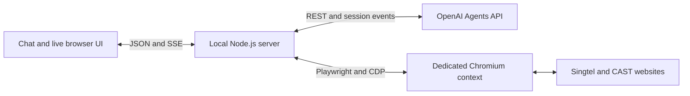

# Maya — Singtel AI Pass demo

Maya is a concept demo that helps a customer redeem Singtel AI Pass on the real CAST website. It combines OpenAI Agents API orchestration with an app-managed Chromium browser driven by Playwright. The browser streams live beside the chat, and the user can take control to sign in with their mobile number and SMS OTP.

This repository contains a local prototype for a single presenter and session. The server listens on `127.0.0.1`; it is not a production or multi-user deployment. Browser automation uses custom function tools, not OpenAI-hosted `computer_use`.

## Quick start

Requirements:

- Node.js 22 or later and npm.
- An OpenAI project API key with access to the Agents API and the configured model. Required scopes: `api.agents.read`, `api.agents.write`, and `api.responses.write`.
- A CAST test account and its SMS phone for rehearsing the real sign-in flow.

```bash
git clone https://github.com/Haorui117/openai-dev.git
cd openai-dev
npm ci
npm run browser:install
cp .env.example .env
```

Set `OPENAI_API_KEY` in your local `.env`, then start the app:

```bash
npm start
```

Open [http://127.0.0.1:4310](http://127.0.0.1:4310) and ask:

> Can you help me redeem my Singtel AI Pass on CAST?

Without an API key, the app displays its setup state and starts no browser or agent session. Restart the server after changing `.env`. Keep an existing `.env` when updating a checkout.

## Demo flow

1. Maya opens the Singtel AI Pass page and follows **Redeem AI Pass** to CAST.
2. At sign-in, click **Take control**. Enter your mobile number and SMS OTP directly into the website in the right-hand browser.
3. Click **Return to Maya** after signing in. The same browser session stays open.
4. Maya locates the empty redemption form and requests authorization.
5. In an armed run, enter the CAST test code into the app's masked field and type `confirm`. The app fills the code and clicks the submit button once.
6. Maya reads CAST's response. The result card includes the reported page text and a screenshot captured by the app.

During takeover, agent browser actions pause and chat is disabled. Human input is not sent to the model or logged by the app. After control returns, Maya can observe the page again; input field values are omitted from observations. The live browser itself is not redacted, so anything visible on the website may appear in a screen recording.

### Rehearsal and the single-use code

**Code submission is locked by default.** Leave `CODE_RELEASE` unset for rehearsals. Maya can reach the form, but the app will not accept a test code.

| Mode | Configuration | Behavior |
| --- | --- | --- |
| Rehearsal | `CODE_RELEASE` unset | Stop at the empty redemption form |
| Recorded redemption | `CODE_RELEASE=enabled` | Require a staged code and explicit `confirm` before submitting |

The CAST test code can only be redeemed once. Do not use it in automated tests or routine rehearsals. Human takeover allows direct interaction with the website; the app's submission gate governs app-driven submissions.

## Architecture



- **Agents API:** maintains the conversation and requests function calls. Sessions use `environment: { type: "none" }` and include the first user message at creation.
- **App server:** executes browser tools, manages ownership and takeover, and enforces redemption authorization.
- **Chromium:** runs in a private, non-persistent context for each run. CDP screencast frames stream to the frontend independently of model turns.
- **Frontend:** vanilla HTML, CSS, and JavaScript. A canvas displays the live browser and forwards mouse, keyboard, and scroll input during takeover.

Maya can observe, navigate, click referenced elements, scroll, switch tabs, request sign-in, request redemption submission, and report a result. There is no model tool for arbitrary JavaScript execution, typing arbitrary text, or reading input values. The app submits the authorized redemption code without giving it to the model.

The events drawer distinguishes **Agents API**, **App · Playwright**, **App**, and **Presenter** activity.

### Submission and recovery behavior

- Submission requires an armed configuration, a staged code, exact confirmation, a still-pending tool request, the unchanged CAST address, valid form references, and application control of the browser.
- Submission bookkeeping is saved before entering the code. A failed journal write prevents submission.
- An uncertain submit click is not repeated. Generic agent clicks and navigation are restricted after a submission attempt to prevent bypassing the authorization flow.
- A result is Maya's reading of the page, supported by an app-captured screenshot; there is no independent CAST backend verification.
- Dropped API connections reconcile pending calls and return saved tool results without repeating completed browser actions.
- A browser crash is reported instead of silently launching a replacement.
- Browser cookies do not survive an app restart. Earlier remote sessions are shown for explicit dismissal or deletion; a new local browser cannot resume their login state.
- **End session** closes Chromium and requests deletion of the OpenAI session. Unknown redemption outcomes require confirmation before ending.

## Configuration

Copy the template in [.env.example](.env.example). Never commit your local `.env`.

| Variable | Default | Purpose |
| --- | --- | --- |
| `OPENAI_API_KEY` | none | OpenAI project API key |
| `OPENAI_AGENT_MODEL` | `gpt-6-astra` | Model used by the agent session |
| `CODE_RELEASE` | locked | Set to `enabled` only for an intentional redemption |
| `PORT` | `4310` | Local application port |
| `START_URL` | Singtel AI Pass page | Initial navigation target |
| `EXPECTED_REDEEM_URL` | CAST voucher redemption login | Expected redemption destination and permitted redemption origin |
| `ALLOWED_HOSTS` | none | Additional hosts allowed for agent browser tools |
| `BROWSER_HEADLESS` | `true` | Set to `false` to also show the Chromium window |
| `BROWSER_CHANNEL` | `chromium` | Set to `chrome` to use installed Google Chrome |

## Development and testing

```bash
npm test               # Unit, browser, run-controller, and HTTP tests
npm run ui:fixture     # Local UI harness at http://127.0.0.1:4311
npm run ui:check       # Interaction checks and screenshots
```

Install Chromium with `npm run browser:install` before running the tests. The `ui:check` script also requires **Google Chrome** installed on the development machine.

The automated suite uses real Chromium against a generic local test page and a scripted Agents API stand-in. It does not contact OpenAI, Singtel, or CAST. The UI harness is clearly marked as a fixture; it is not a simulated CAST page or proof of a real redemption. Its sample codes are `FIXTURE-CONFIRM` and `FIXTURE-REJECT`.

UI checks exercise scaled pointer input, typing, scrolling, takeover, stream disconnects, and recovery at 1920×1080 and 1440×900. Screenshots are written to the ignored `ui-check-output/` directory.

### Collaboration workflow

1. Create a branch for your change: `git switch -c feature/short-description`.
2. Keep credentials and account-specific settings in your own `.env`.
3. Run `npm test`. For browser or UI changes, also run `npm run ui:check`.
4. Update the README or design notes when configuration, user flows, or architecture change.
5. Open a pull request describing the change and validation performed. Keep commits focused and reviewable.

Do not commit API keys, real account details, OTPs, redemption codes, `.data/`, or screenshots containing customer information. Generated files, browser-test outputs, and local environment files are excluded by `.gitignore`.

### Project layout

```text
server/                 HTTP server, API client, browser runtime, tools, run state
public/                 Chat and interactive browser UI
scripts/                Local UI harness and visual checks
test/                   Automated tests and local fixtures
DESIGN-SPEC.md           Current product scope and interaction design
IMPLEMENTATION-PLAN.md   Architecture decisions and implementation milestones
docs/archive/           Superseded design notes
```

## Validation status and remaining checks

The migration passed 54 automated tests and the UI checks. Independent live API validation reached the real CAST sign-in page and exercised live frames, takeover, input, and return of control through the full UI.

**Real SMS sign-in and redemption have not been tested.** Before recording, rehearse the OTP flow and navigation to the empty code form with submission locked. The post-login page structure, account eligibility, code expiry, and final submission behavior still need verification with the test account. Reserve the single-use code for the intended redemption take.

See [DESIGN-SPEC.md](DESIGN-SPEC.md) and [IMPLEMENTATION-PLAN.md](IMPLEMENTATION-PLAN.md) for further details.
